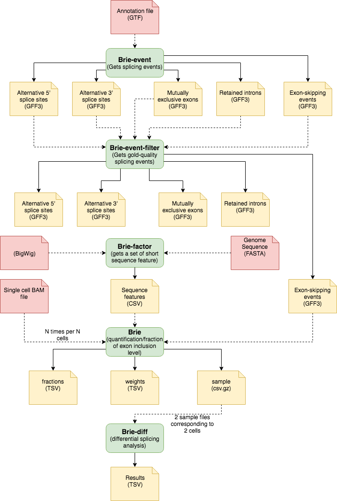

# Introduction

**BRIE** is a Bayesian method to estimate isoform proportions from RNA-seq data. Currently, BRIE could take sequence features to automatically learn informative prior of exon inclusion ratio in exon-skippiing events


# Get splicing events

`brie-event` uses an annotation file (`.gtf` file) to obtain splicing events such as:

- Alternative 5' splice sites
- Alternative 3' splice sites
- Mutually exclusive exons
- Retained introns

It generates GFF3 files with splicing events information

`brie-event-filter` retrieves gold-quality splicing events only. See constraint criteria on [BRIE: splicing events](https://brie-rna.sourceforge.io/manual.html#splicing-events).

# Get sequence features

`brie-factor` gets a set of short sequence feature from the annotation file. It needs a BigWig file and the genome sequence in FASTA format.

> `brie factor` needs `bigWigSummary` to work, it may be downloaded from [UCSC website](http://hgdownload.cse.ucsc.edu/admin/exe/linux.x86_64/bigWigSummary). See below.

```bash
cd /shares/common/users/j.alquicira/software/brie-master
wget http://hgdownload.cse.ucsc.edu/admin/exe/linux.x86_64/bigWigSummary
--2017-04-27 18:43:28--  http://hgdownload.cse.ucsc.edu/admin/exe/linux.x86_64/bigWigSummary
Resolving hgdownload.cse.ucsc.edu... 128.114.119.163
Connecting to hgdownload.cse.ucsc.edu|128.114.119.163|:80... connected.
HTTP request sent, awaiting response... 200 OK
Length: 4359384 (4.2M) [text/plain]
Saving to: `bigWigSummary'

100%[==================================================================================================================================>] 4,359,384   1.45M/s   in 2.9s    

2017-04-27 18:43:32 (1.45 MB/s) - `bigWigSummary' saved [4359384/4359384]
```


```bash
chmod +x /shares/common/users/j.alquicira/software/brie-master
export PATH="/shares/common/users/j.alquicira/software/brie-master:$PATH"
```

A `csv` file with sequence features is generated.

# BRIE isoform estimate

`brie` quantifies the fraction of exon inclusion level. It uses a BAM file corresponding to a single cell, the sequence features used as priors to the bayesian model and the annotation file generated with `brie-event`. The output are three files:

- `fractions.tsv`: contains fractions for each isoform (called *Psi*)
- `weights.tsv`: contains weights for the Bayesian regression
- `sample.csv.gz`: contains MCMC samples of posterior distribution of Psi. These samples are used to detect the differential splicing

# Differential splicing

`brie-diff` detects differential splicing between many cells pair-wisely, including just two cells, by calculating Bayes factor. The output is a `.tsv` file with differential plicing results.

