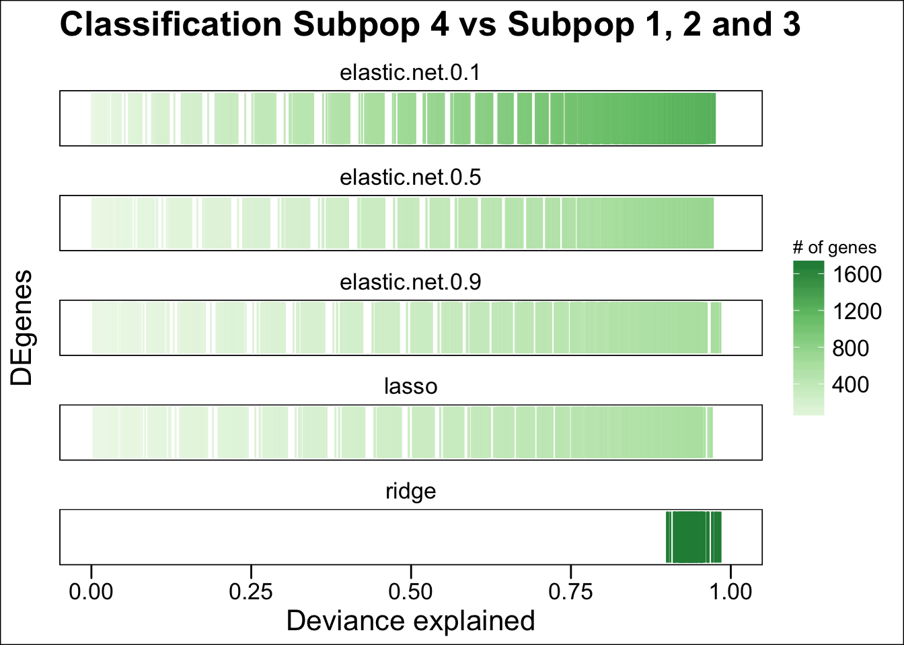

# 1/May/2017 - 16/May/2017 

## 8/May/2017

### Description 

*Quan* provided a script via Slack to make predictions for the **Cardiodiff data**:

```
https://computationalgenomics.slack.com/files/quan/F59DM8QV7/lasso_extract_cvfit_parallel.r 
```

This script is designed to predict cell cluster-identity using gene expression data. This script is fixed to implement lasso only. It also uses the foreach package to parralelize a bootstrapping step.

### TODO

- Adapt script to run other models besides lasso
- Make a comparison of prediction accuracy across different regularization models such as lasso, elastic net (with different alpha parameters) and ridge

# 15/May/2017

## Description 

A comparison between lasso, ridge and elastic net was performed using `lasso_extract_cvfit_parallel.r` script. However, current implementation doest permit using the same training and test datasets if run for different models. 

Cardiodiff datasets used:

- **Cluster cell labels**: my.clusters_0.45_Day2.RDS
- **Expression data**: Exprs_DCVLnorm_unlog_minus1_pos_Day2.RDS
- **Differential expressed genes**: DEseq_Cluster1_vs_OtherClusters_Day2.txt_filtered_pAdjusted_sorted.txt

Data features:

- Day: 2

## Results

The following results corresponds to predicting cell cluster-identity (cluster 1 vs all other clusters). As seen in figure below, elastic net method with an alpha value of `0.1` tends to perform better than all remaining methods. Lasso accuracy is lower than all elastic net methods. Ridge is the worst method, probably because it uses all features to make the predictions (and not all differentially expressed genes may contribute to explain cluster identity). 


## Goals

- Adapt script to take same random samples for training and test data to make a valid comparison between regularization methods
- Modularize code

## Perspectives

- Possible R package implementation?


# 16/May/2017

## Description

Conceptual workflow was designed to restructure `lasso_extract_cvfit_parallel.r` in order to use different models to make predictions. See flowchart below.

## Results


Coding process started.

# 17/May/2017

## Description

`lasso_extract_cvfit_parallel.r` was restructured into `prediction.Rmd`. Modularization of `Lit_New_Lasso` and accuracy extraction was done. 

`prediction.Rmd` was run to predict cells corresponding to cluster **1** in the day 2 for the **Cardiodiff** data. 100 interations were set. An error occured:

```
Error in { : task 100 failed - "NA/NaN argument"
Calls: %dopar% -> <Anonymous>
Execution halted
```

The 100th iteration failed. One possible explanation could be in the sampling process:

```R
  # Random sampling for training data --------------------------------------
  # Take random sample of cells corresponding to cluster of interest
  cluster.select.indx <- sample(cluster.select, 
                                size = round(length(cluster.select)/2), 
                                replace = FALSE)
  # Take random sample of cells corresponding to cluster to be compared
  cluster.compare.indx <- sample(cluster.compare, 
                                 size = round(length(cluster.compare)/2), 
                                 replace = FALSE)
  
  # Build predictor matrix -------------------------------------------------
  # Prepare predictor matrix containing both clutering classes
  predictor <- expression.data[features, c(cluster.select.indx, cluster.compare.indx)]
  
  # Generate categorical response ------------------------------------------
  # Set all values to cluster of interest
  response <- rep(clusterID.select, ncol(predictor))
  cluster.compare.names <- colnames(expression.data[,cluster.compare])
  sub.clustercompare.indx <- which(colnames(predictor) %in% cluster.compare.names)
```


# 18/May/2017

## Description

`prediction.Rmd` now includes three functions:

- `BuildTrainTest`: Creates Training and testing datasets
- `FitRegModel`: Runs regularization models using the output from `BuildTranTest`
- `ExtractResults`: Extracts results from *glmnet* object

It also uses the same training and testing datasets for all models.

## Results

`prediction.Rmd` was run to predict cells corresponding to cluster **1** in the day 2 for the **Cardiodiff** data. 50 bootstrapping interations were performed.

The following plots show that the **elastic net** algorithm performs better than lasso and ridge methods. The best model in terms of accuracy was using an alpha parameter of `0.1`.


@Joseph commented:

> great! However, we will need to have a justification for the alpha level - but the results shows that it’s better (than lasso) for all values! 


@Quan notice the following:
> it looks great, do you have the number of genes for each model?
> 
> usually biologists want to select a small set of genes that can predict well the cell groups

Considering the previous, the following plot was generated. 


Elastic net method with and alpha equals 0.1 is the best. However, it uses **539 genes** in average while **lasso only uses 192 genes**.

Five-number + mean of number of genes included in each model:

|       |elastic.net.0.1  |elastic.net.0.5 |elastic.net.0.9 |lasso           | ridge        |
|:------|:---------------:|:--------------:|:--------------:|:--------------:|:------------:|
|Min    | 331.0           |102.0           |87.0            |82.0            |2817          |
|1st Qu.| 424.2           |183.2           |155.5           |116.0           |2817         |
|Median | 534.0           |214.5           |206.0           |174.0           |2817         |
|Mean   | 539.3           |239.4           |205.5           |192.3           |2817         |
|3rd Qu.| 646.0           |290.8           |253.8           |251.5           |2817         |
|Max.   | 767.0           |448.0           |386.0           |412.0           |2817         |

Considering @Quan's and @Joseph's comments on the alpha value, we should think about considering the trade off between accuracy and number of genes incorporated(the fewer genes are included for the regressions in each model, the lower the accuracy). The amount of genes in this case depends on the value of alpha.

**See commit** [ef27d15](https://github.com/IMB-Computational-Genomics-Lab/SingleCell_Prediction/commit/ef27d152ea7fb15c443d8231f7c4ade49ce89bd2)

## TODO

- Fix error associated to sampling `"NA/NaN argument"`
- Run regularization methods allowing interaction between variables
  + To reduce the number of combinations between coefficients when fitting the regression models, consider taking into account TF networks to decide which interaction between genes (features) are pertinent.

# 19/05/2017

# Description

`prediction.Rmd` was modified to find out training and testing dataset features that are problematic and causes the error `"NA/NaN argument"`. Random seeds were tracked to reproduce errors.

Desktop analysis (in laptop) of a small dataset with 120 genes and 5905 cells produced a error in the first iteration:

```R
##############################################################
Iteration: 1 
---------- 
Seed for cluster select: 30308
Seed for cluster compare: 29664

##############################################################
Iteration: 2 
---------- 
Seed for cluster select: 30288
Seed for cluster compare: 15632
---------- 
test    : 4347 20 
training: 2952 20 
response: 2952 
##############################################################
---------- 
test    : 4347 20 
training: 2952 20 
response: 2952 
##############################################################

##############################################################
Iteration: 3 
---------- 
Seed for cluster select: 4703
Seed for cluster compare: 11372
---------- 
test    : 4334 20 
training: 2952 20 
response: 2952 
##############################################################

##############################################################
Iteration: 4 
---------- 
Seed for cluster select: 20287
Seed for cluster compare: 15691
---------- 
test    : 4365 20 
training: 2952 20 
response: 2952 
##############################################################

##############################################################
Iteration: 5 
---------- 
Seed for cluster select: 16195
Seed for cluster compare: 6986
---------- 
test    : 4351 20 
training: 2952 20 
response: 2952 
##############################################################

##############################################################
Iteration: 6 
---------- 
Seed for cluster select: 16235
Seed for cluster compare: 2033
---------- 
test    : 4335 20 
training: 2952 20 
response: 2952 
##############################################################

##############################################################
Iteration: 7 
---------- 
Seed for cluster select: 12599
Seed for cluster compare: 10577
---------- 
test    : 4335 20 
training: 2952 20 
response: 2952 
##############################################################

##############################################################
Iteration: 8 
---------- 
Seed for cluster select: 26503
Seed for cluster compare: 30302
---------- 
test    : 4371 20 
training: 2952 20 
response: 2952 
##############################################################

##############################################################
Iteration: 9 
---------- 
Seed for cluster select: 10426
Seed for cluster compare: 14164
---------- 
test    : 4329 20 
training: 2952 20 
response: 2952 
##############################################################

##############################################################
Iteration: 10 
---------- 
Seed for cluster select: 7977
Seed for cluster compare: 16071
---------- 
test    : 4338 20 
training: 2952 20 
response: 2952 
##############################################################
Error in { : task 1 failed - "NA/NaN argument"
```

In the debugging process, the following error was found for iteration 1 using the same random seeds inside the `foreach` parallel loop:

```R
> predict.marker <- FitRegModel(test, training, response, family = "binomial", alpha = 0.1)
Error in 1:cvfit.dev.lambda.idx[1] : NA/NaN argument
```

Error was tracked manually using the random seeds form iteration 1. The error origin is the following:

```R
cvfit.dev.lambda.idx <- which(round(cvfit.dev$lambda,digit = 3) == round(cvfit$lambda.min,digits = 3))
```

Sometimes `cvfit.dev$lambda.min` is not found in `cvfit.dev$lambda`


```R
> round(cvfit.dev$lambda,digit = 3)
  [1] 1.817 1.655 1.508 1.374 1.252 1.141 1.040 0.947 0.863 0.786 0.716 0.653 0.595 0.542 0.494 0.450 0.410 0.374 0.340 0.310 0.283 0.258 0.235 0.214 0.195
 [26] 0.178 0.162 0.147 0.134 0.122 0.112 0.102 0.093 0.084 0.077 0.070 0.064 0.058 0.053 0.048 0.044 0.040 0.036 0.033 0.030 0.028 0.025 0.023 0.021 0.019
 [51] 0.017 0.016 0.014 0.013 0.012 0.011 0.010 0.009 0.008 0.008 0.007 0.006 0.006 0.005 0.005 0.004 0.004 0.004 0.003 0.003 0.003 0.002 0.002 0.002 0.002
 [76] 0.002 0.002 0.001 0.001 0.001 0.001 0.001 0.001 0.001 0.001 0.001 0.001 0.001 0.001 0.000 0.000 0.000 0.000 0.000 0.000 0.000 0.000 0.000 0.000 0.000
```

```R
round(cvfit$lambda.min,digits = 3)
[1] 0.111
```

**See commit** [c31d926](https://github.com/IMB-Computational-Genomics-Lab/SingleCell_Prediction/commit/c31d926e3a61ab85e82b7c95eefccc22baaf0b91)

From previous results, we can see that **0.112 ~ 0.111**. `0.112` is the closest value to `cvfit.dev$lambda`.


The following algorithm in [stat.ethz.ch](https://stat.ethz.ch/pipermail/r-help/2012-February/302827.html) was implemented to find the nearest lambda value to `cvfit.dev$lambda.min` in vector `cvfit.dev$lambda`:

```R
cvfit.dev.lambda.idx <- which.min(abs(cvfit.dev$lambda -cvfit$lambda.min))
cvfit.dev <- cvfit.dev[1:cvfit.dev.lambda.idx,]
```

See commit [da91950](https://github.com/IMB-Computational-Genomics-Lab/SingleCell_Prediction/commit/da91950303a123398375794aba44341739efbc95)

## Results

The following comparison between lasso, elastic net and ridge was performed for 100 bootstrap replicates using the new version of `prediction.Rmd`. No errors were generated due to selecting the minimum alpha value. We observe the same tendency: elastic net still performs better (particulary using an alpha value of `0.1`).


|         |elastic.net.0.1 |elastic.net.0.5 |elastic.net.0.9 |    lasso     |    ridge    |
|:--      |---------------:|---------------:|---------------:|-------------:|------------:|
|Min      |        301.0   |         84.0   |         73.0   |         64.0 |        2817 |
|1st Qu.  |        459.2   |        179.8   |        134.0   |        135.5 |        2817 |
|Median   |        543.5   |        227.5   |        171.5   |        184.0 |        2817 |
|Mean     |        543.5   |        247.3   |        190.0   |        186.4 |        2817 |
|3rd Qu.  |        623.8   |        317.8   |        240.5   |        230.2 |        2817 |
|Max.     |        775.0   |        491.0   |        379.0   |        393.0 |        2817 |

If the number of genes is considered to decide which model is better, a weighted accuracy (using the number of genes included in each model) may be useful measure. The following plot shows the weighted accuracy of each model (notice that ridge has a weighted accuracy of zero since it uses all genes for the prediction).


See commit [4ae9b50](https://github.com/IMB-Computational-Genomics-Lab/SingleCell_Prediction/commit/4ae9b505a8d5eec34391d0c1cccdb9f2601a3529)

Results may be found on delta in the results directory

```
results/2017-05-19_CardioDiffAnalysis/prediction_cardiodiff_day2
```
## TODO

- Run 100 replicates using the IPSC single cell data


# 22/05/2017

## Description

hiPSC data was copied from @Quan's directory to `/shares/common/users/j.alquicira/SingleCell_Prediction/data/2017-05-22_HiPSC` on Delta.

```
cp /shares/common/groups/Group-Powell/shares-data/powell/quan/Expression_data_HiPSC_5day0Samples.RDS .
```

Differential gene expression was provided by @Quan via [Slack](https://files.slack.com/files-pri/T0F3BL6HX-F5E1FVDCL/download/significant_degenes_hipsc_day0.tar.gz)


## Results

Accuracy across models are similar. These results agree with the estimations reported in [previous analysis](http://biorxiv.org/content/early/2017/03/22/119255). Only 99 genes were used as features.


The number of genes included in all models (except ridge) is not variable across models as well.


See commit [8fc3d60](https://github.com/IMB-Computational-Genomics-Lab/SingleCell_Prediction/commit/8fc3d60ac564a1933a92109c73e8834f5e80f35d)

> Note: style figures were modified

## TODO

- Run analysis comparing cluster 4 versus others
- Analyse pathways and identified co-regulation (in order to add variable interaction in models)


# 23/05/2017

## Results

Deviance explained was plotted for all models. Note that this results are similar to the ones [reported already](http://biorxiv.org/content/early/2017/03/22/119255). In the following figure the deviance explanation is shown. The cluster comparison was 1 vs 2,3 and 4.


# 24/05/2017

## Results

Model accuracy for lasso is better than the one [reported previously](http://biorxiv.org/content/early/2017/03/22/119255) (around 90% versus 99% - 100%). 


In the density plot below we can see a bimodal distribution of accuracy across all models.


Lasso and elastic net 0.9 chose a smaller number of genes for making the predictions.


The performance is also better when comparing the deviance explained by the models.



